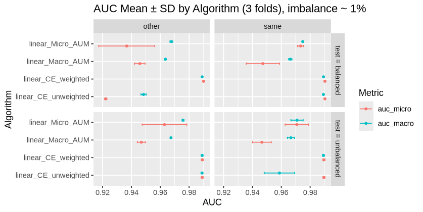
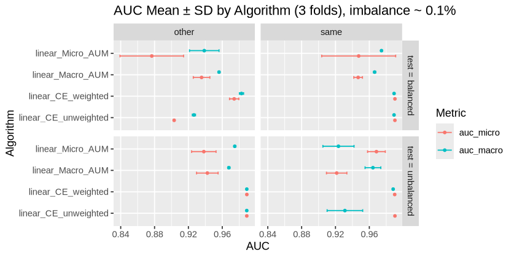

# Multi-class AUM for imbalanced datasets using R
I used [AUM_comparison.r](AUM_comparison.r) to train NNs on the cluster . I generated [score_conv_grid_search.csv](score_conv_grid_search.csv) which contains test results for CNNs using different loss functions

  

  

## Analysis

- When training on imbalaced datasets , both AUMs are better than unweighted cross entropy. But weighted entropy is better ( and faster ).
- Micro AUM optimizes Macro AUC , but Macro AUM doesn't optimize Micro AUC. Not what I expected for the (train=balanced,test=balanced) 
-When employing Macro AUC as the evaluation metric(which is generally more appropriate for imbalanced datasets) we observe that the performance gap between Macro AUM and Micro AUM widens with increasing class imbalance, with Macro AUM having better performance under higher imbalance . ( 1% Micro AUM was better, 0.1% Macro AUM was better )
- Training Micro AUM on an imbalanced dataset and testing it on a balanced  set gives poor Micro AUC performance. This is because Micro AUM treats all examples equally during training and does not optimize for the minority class. So, the model fails to perform well on the balanced test set where the minority class is better represented.

## Next steps:
- Look for cases where AUM is better
- Try application : pre-training for LMs
- smaller batchsize
